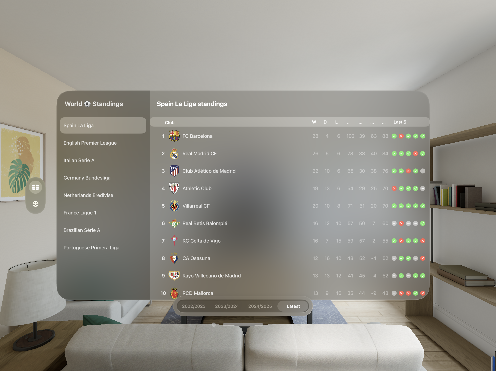
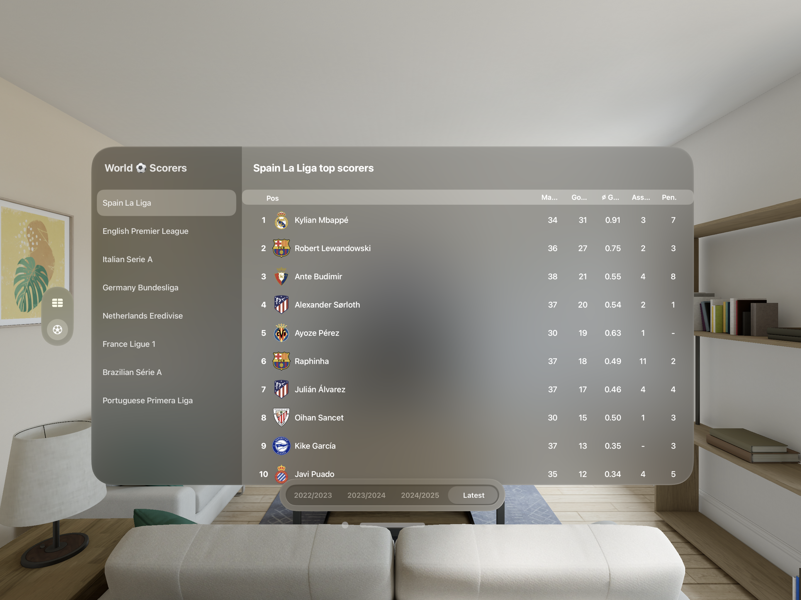

# ⚽️ FootballStatApp - Spatial Computing Football Analytics

### 01. Brief Description of Project 

FootballStatApp is an innovative visionOS application designed for Apple Vision Pro that transforms traditional football statistics into immersive spatial computing experiences. The app provides real-time access to league standings and top scorers data from major football competitions including Premier League, La Liga, and other top-tier leagues. Built with SwiftUI and RealityKit, it leverages spatial computing capabilities to create an engaging, three-dimensional data visualization experience that goes beyond conventional sports apps.
#

### 02. Users of the System

**Primary Users:**

- **Football Enthusiasts:** Passionate fans seeking immersive ways to consume and interact with football statistics
- **Sports Analysts:** Professionals requiring comprehensive league insights and player performance data
- **Casual Sports Viewers:** Users wanting quick, visual access to current league standings and scorer information
- **Early Technology Adopters:** Users interested in experiencing cutting-edge spatial computing applications

**Target Demographics:**

- Age range: 18 - 45 years
- Tech-savvy individuals with Apple Vision Pro devices
- Sports fans who appreciate data-driven insights
- Users comfortable with mixed reality interfaces
#

### 03. What is unique about your solution

🥽 **Spatial Computing Innovation**:
  - **3D Data Visualization**: Transforms flat statistical tables into immersive spatial experiences
  - **Natural Interaction**: Utilizes hand tracking and gesture-based navigation for intuitive data exploration
  - **Multi-dimensional Display**: Enables simultaneous viewing of multiple leagues and statistics in 3D space
  - **Immersive Team Representation**: Club crests and statistics float in three-dimensional space with realistic depth

</> **Technical Differentiators**:
  - First-of-its-kind football statistics app optimized for visionOS
  - Real-time API integration with offline fallback capabilities
  - Advanced 3D scene rendering using RealityKit
  - Seamless integration with spatial computing gestures and interactions
#

### 04. Functionality of the screens

The app features a dual-tab structure providing access to different types of football data:

⚽️ **Standings Tab**:

  - Interactive league tables with 3D team positioning
  - Real-time standings from multiple competitions
  - Win/Draw/Loss visualization with form indicators
  - Goal statistics and points tracking

 

🥇 **Top Scorers Tab**:

  - Player performance metrics in spatial layouts
  - Goals, assists, and match statistics
  - Team affiliation with visual connections
  - Historical season comparisons

 

Navigation Features

  - **Competition Selection**: List-based navigation for different leagues
  - **Season Filtering**: Segmented control for historical data access
  - **Real-time Updates**: Live data fetching with loading states
  - **Responsive Design**: Adaptive layouts for different viewing contexts

#

### 05. Learning Reflection

Technical Skills Acquired

  - **visionOS Development**: Gained hands-on experience with Apple's newest platform
  - **RealityKit Integration**: Learned 3D scene creation and spatial content rendering
  - **SwiftUI Advanced Patterns**: Implemented complex observable patterns and data binding
  - **API Integration**: Mastered asynchronous data fetching with error handling

Spatial Computing Concepts

  - **3D UI Design**: Understanding spatial interface principles and user experience considerations
  - **Mixed Reality Development**: Learned to design for immersive environments
  - **Gesture-based Interactions**: Implemented natural hand tracking and spatial navigation

Development Methodologies

  - **MVVM Architecture**: Applied modern iOS development patterns to spatial computing
  - **Modular Design**: Created reusable components for different data types
  - **Data Management**: Implemented robust error handling and offline capabilities

#

### 06. UI Components used

#### (1) SwiftUI Components
- **TabView**: Main navigation structure
- **NavigationSplitView**: Master-detail interface for competition selection
- **Table**: Advanced table views for displaying standings and scorer data
- **AsyncImage**: Dynamic image loading for team crests
- **Picker**: Segmented controls for season filtering
- **ProgressView**: Loading state indicators

#### (2) RealityKit Components
- **Model3D**: 3D content rendering from ```ContentView.swift```
- **RealityKitContent**: Custom 3D scenes from ```RealityKitContent.swift```
- **Spatial Materials**: Grid-based materials defined in ```GridMaterial.usda```

#### (3) Custom Components
- **Observable Classes**: ```StandingsTableObservable``` and ```TopScorersTableObservable``` for data management
- **Fetch Phase System**: ```FetchPhase.swift``` for handling different data loading states
- **Utility Functions**: ```Utility.swift``` for data formatting and JSON parsing

#

### 07. Documentation 

#### (a) Design Choices

**Architecture Decisions**:
- MVVM Pattern: Separated data logic into observable classes for better maintainability
- Modular Structure: Created distinct view files for different functionalities
- API Integration: Used XCAFootballDataClient for reliable data fetching
- Offline Support: Implemented local JSON stubs for development and fallback scenarios

**User Experience Design**:
- Tab-based Navigation: Simple, familiar interface structure
- Master-Detail Layout: Efficient use of spatial interface real estate
- Visual Consistency: Unified design language across all components
- Responsive Loading States: Clear feedback during data fetching operations

#### (b) Implementation Decisions

**Data Management**:
- Implemented ```@Observable``` pattern for reactive UI updates
- Created robust error handling with ```FetchPhase``` enum
- Used async/await for modern concurrency handling
- Integrated real API with local stub fallbacks

**3D Integration**:
- Utilized RealityKit for spatial content rendering
- Created modular 3D assets in separate package structure
- Implemented proper bundle management for 3D resources

**Performance Optimization**:
- Efficient image loading with AsyncImage caching
- Task cancellation handling for better resource management
- Optimized data structures for table rendering

#### (c) Challenges

**Technical Challenges**:
- visionOS Learning Curve: Adapting to new platform APIs and spatial design principles
- 3D Content Creation: Learning RealityKit and USD file formats for 3D scenes
- API Integration: Handling real-time data with proper error states and offline fallbacks
- Spatial UI Design: Designing interfaces that work well in 3D space

**Development Environment**:
- Limited Documentation: Working with bleeding-edge visionOS APIs with minimal examples
- Simulator Limitations: Testing spatial features without physical hardware
- Debugging Complexity: Troubleshooting 3D rendering and spatial interactions

### 08. Reflection

The biggest challenge in developing FootballStatApp was adapting to spatial computing, which required completely rethinking how users interact with data. Unlike traditional 2D apps, designing for 3D space meant considering depth, positioning, and how football statistics would look floating in mixed reality. Since visionOS is Apple's newest platform, there were limited tutorials, community resources, and best practices available, forcing me to learn through trial and error. Testing was also difficult without consistent access to physical Apple Vision Pro hardware, relying mostly on the simulator which couldn't fully replicate real spatial interactions.

This project taught me that spatial computing isn't just about adding 3D elements to existing apps – it requires fundamentally different thinking about user experience and interface design. I learned the importance of modular architecture when working with emerging technologies, as it made the app more maintainable and easier to debug. Performance optimization became even more critical in spatial computing, since any lag or visual inconsistencies immediately break the immersive experience that makes these apps compelling.

Working with visionOS also showed me the transformative potential of spatial computing for data visualization. While challenging due to limited resources and documentation, this project positioned me at the forefront of an emerging technology that will likely become mainstream. The experience reinforced the value of experimenting with new platforms early, even when the learning curve is steep, as it provides insights into the future direction of user interface design.

  

